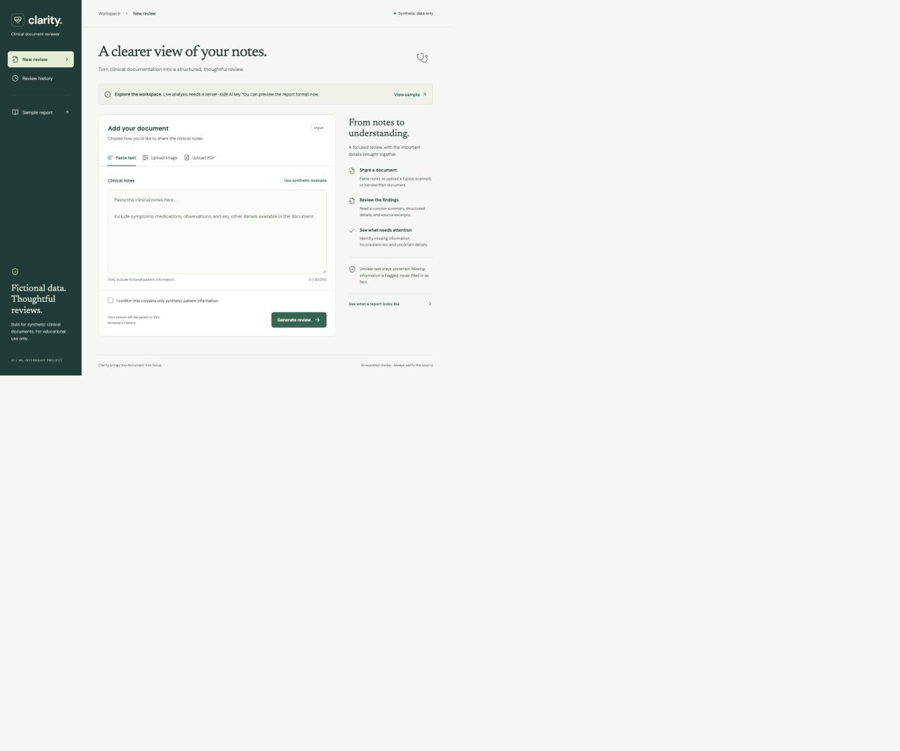
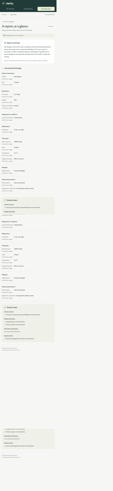

# Clarity — AI Clinical Document Reviewer

Clarity turns synthetic clinical notes, images, and PDFs into readable, source-linked clinical reviews. It is a React application backed by a dedicated FastAPI service, structured AI extraction, and durable relational storage.

**Current status:** Local frontend and backend are implemented and tested. Real AI inference and public deployment still require an AI API account/key and hosting setup. The sample report is explicitly illustrative; it is not a live analysis. Do not submit this project as fully deployed until the live verification checklist is complete.



## Features

- Text, PNG/JPEG/WebP, and PDF input with server validation.
- Embedded PDF text extraction plus visual processing for scans and handwriting through the configured model.
- Summary-first reports: patient details, symptoms, diagnoses, medications, vital signs, allergies, observations, concerns, missing information, inconsistencies, and review items.
- Expandable source excerpts and uncertainty labels.
- Background processing, visible errors, and restart recovery.
- Session-owned report history with timestamps, statuses, summaries, and full reports.
- Synthetic fixtures and a clearly labeled sample report.
- Same-origin deployment: frontend and backend can share one URL.

All development and demonstration data must be synthetic. This is an educational application, not clinically validated software.

## Technology and structure

React / TypeScript / Vite, FastAPI / Pydantic, SQLAlchemy / Alembic, SQLite locally and PostgreSQL in deployment, PyMuPDF / Pillow for document decoding, and the OpenAI Python SDK for multimodal extraction and structured output. `AI_MODEL` is configurable; the default is `gpt-4.1-mini`.

```text
backend/app/        API, validation, document processing, AI adapter, worker, database
backend/alembic/    Database migration
backend/tests/      Backend regression and integration tests
frontend/src/       React interface and UI tests
samples/            Fictional clinical text, images, and PDFs
scripts/            Sample generator and local startup helper
docs/               Architecture, AI design, decisions, verification, screenshots
Dockerfile          Combined frontend/backend container
compose.yaml        Local app + PostgreSQL
railway.json        Railway deployment configuration
render.yaml         Optional Render deployment blueprint
```

## Local setup

Requirements: Python 3.12 or 3.13; Node.js 22.12+ or 24; pnpm 11.19.0. This project was verified with Python 3.13 and Node 24. Docker is optional.

```bash
python3 -m venv .venv
source .venv/bin/activate
pip install -r backend/requirements.lock
cp .env.example .env
python -c "import secrets; print(secrets.token_urlsafe(48))"
```

Put the generated value in `SESSION_SECRET` in `.env`. Keep it stable across restarts to retain access to the same browser's history. Put your own OpenAI API key in `AI_API_KEY` to enable live inference. Without a key, the interface and sample remain available and submissions return a clear 503 error. Credentials never belong in frontend code or Git.

Install frontend dependencies:

```bash
npm install -g pnpm@11.19.0
cd frontend
pnpm install --frozen-lockfile
cd ..
```

Run the backend (terminal 1):

```bash
source .venv/bin/activate
cd backend
uvicorn app.main:app --host 127.0.0.1 --port 8000
```

Run the frontend (terminal 2):

```bash
cd frontend
pnpm dev
```

Open http://127.0.0.1:5173. Vite proxies `/api` to port 8000. Use the same hostname consistently so session cookies remain associated with the right host.

For a production-style local preview, run `pnpm --dir frontend build`, then start the backend and open http://127.0.0.1:8000. The backend serves the compiled frontend. The OpenAPI schema is available at `/openapi.json`; interactive `/docs` currently uses a CDN that the production content-security policy blocks, so use the schema or a local API client.

### Configuration

| Variable | Purpose |
|---|---|
| `AI_API_KEY` | Server-only OpenAI key; required for live analysis |
| `AI_MODEL` | Multimodal structured-output model; default `gpt-4.1-mini` |
| `SESSION_SECRET` | Random signing secret; at least 32 characters in production |
| `DATABASE_URL` | SQLite URL locally or PostgreSQL URL in deployment |
| `APP_ORIGIN` | Exact browser origin, including scheme; HTTPS required in production |
| `ENVIRONMENT` | `development` or `production` |
| `UPLOAD_DIR` | Optional writable directory for temporary processing inputs |
| `MAX_PENDING_JOBS` | Global outstanding-job cap; default 8 |
| `SUBMISSIONS_PER_HOUR` | Per-session hourly cap; default 10 |
| `GLOBAL_SUBMISSIONS_PER_HOUR` | App-wide hourly cap; default 50 |
| `JOB_TIMEOUT_SECONDS` | Overall review deadline; default 300 |

Limits: 20,000 text characters, 10 MB per file, 10 PDF pages, 20 megapixels per image. Processing also rejects extracted text beyond 20,000 characters. The total HTTP body cap is 11 MB to allow multipart overhead. Session cookies expire after 30 days; clearing cookies loses access to that session's reports.

### Database

Startup applies Alembic migrations automatically. SQLite creates `backend/clinical.db` when run from `backend/`. For PostgreSQL, set `DATABASE_URL`; `postgres://` and `postgresql://` URLs are normalized to the psycopg driver. To apply migrations manually:

```bash
cd backend
../.venv/bin/alembic upgrade head
```

Never run multiple API workers or replicas with the current job worker. Restart recovery assumes exclusive ownership of pending jobs.

### Docker and PostgreSQL

After creating `.env` and setting `SESSION_SECRET`:

```bash
docker compose up --build
```

Open http://localhost:8000. The compose database credentials are for local development only. Database files live in a named Docker volume. Container and real PostgreSQL verification are pending when Docker is unavailable; see `docs/verification.md`.

## API

Get `/api/session` first to establish the signed browser session. Send the session cookie with subsequent requests.

| Endpoint | Behavior |
|---|---|
| `GET /api/health` | Database health and whether AI credentials are configured; no secrets |
| `GET /api/session` | Create/reuse browser session |
| `POST /api/analyses` | JSON `{text, synthetic_confirmed: true}` or multipart `file` + `synthetic_confirmed=true`; returns 202 and job ID |
| `GET /api/analyses?offset=0&limit=20` | Paginated history for this session |
| `GET /api/analyses/{id}` | Status, summary, detailed report, evidence, or failure message |

Errors use `{ "error": { "code": "...", "message": "..." } }`. Typical statuses: 401 expired session, 403 invalid browser origin, 404 unknown/foreign report, 413 body too large, 422 invalid input, 429 capacity/rate limit, 503 missing AI configuration.

## Testing

```bash
.venv/bin/pytest -c backend/pyproject.toml backend/tests -q
pnpm --dir frontend test
pnpm --dir frontend build
```

Automated tests use a deterministic provider fixture for API workflow checks. They exercise the actual database, worker, schema checks, document decoders, and session boundaries; they do not prove model quality. Separately verify the real provider against all synthetic inputs before submission. Regenerate samples with `.venv/bin/python scripts/generate_samples.py`.

## Deployment

The application needs a persistent container process and PostgreSQL. A static host or short-lived serverless function alone is insufficient for the current background worker.

For your Railway account, follow [the Railway deployment guide](docs/deployment-railway.md). `railway.json` defines the Docker build, health check, and one replica.

Alternatively, `render.yaml` describes one Docker web service and one PostgreSQL database. Review the provider's costs before creating resources. Configure `AI_API_KEY` and set `APP_ORIGIN` to the exact assigned HTTPS URL, without a trailing slash. Keep one instance and one Uvicorn worker. The same URL serves the frontend and `/api`, so a separate API host is unnecessary.

Public application URL: **pending deployment**.

Before submission, verify every item in [the live checklist](docs/verification.md). Replace the pending deployment status with actual URLs only after successful deployment.

## Design documentation

- [Architecture and data flow](docs/architecture.md)
- [AI/ML design and uncertainty handling](docs/ai-design.md)
- [Technical decisions and limitations](docs/technical-decisions.md)
- [Verification evidence and pending checks](docs/verification.md)


