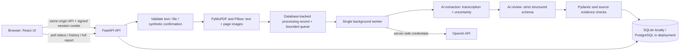

# Architecture

The backend owns all parsing, model calls, validation, and persistence. React handles input, feedback, report presentation, and history. The production container serves the built React files and API from one origin. No credentials reach the browser.

A submission is validated before a processing record is created. The prepared input is temporarily stored with a generated filename; its path is associated with the database record. A bounded in-process queue hands IDs to a single worker. This is intentionally a single-process deployment. Pending records survive restart, but interrupted work is marked failed rather than silently retried and charged again. Temporary input is deleted after success/failure and cleaned on recovery.

The worker saves the validated report, summary, and evidence. Dates and statuses remain queryable even for failed jobs. Session ownership is checked on every history/detail query; a foreign ID returns 404. Browser sessions are signed, HttpOnly, SameSite=Lax, and Secure in production. Database-backed global and session submission caps bound usage but are not a replacement for production authentication or an edge firewall.

No real clinical records are in this repository. The frontend sample is an explicit static illustration and does not create a completed job.
